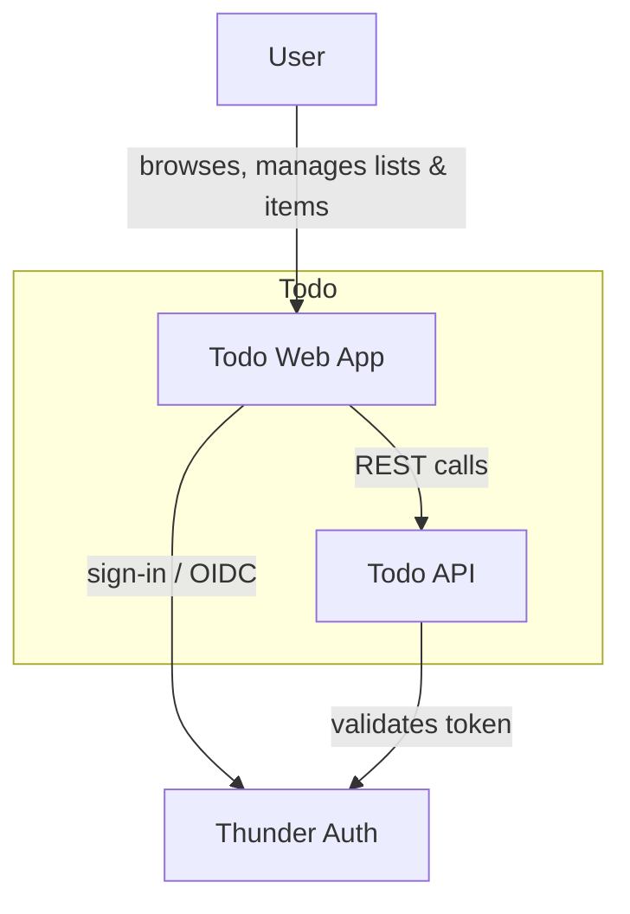
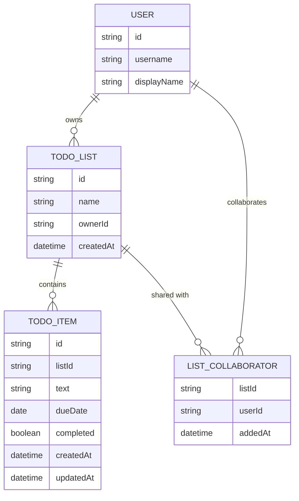
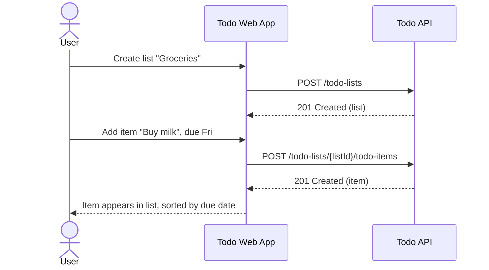
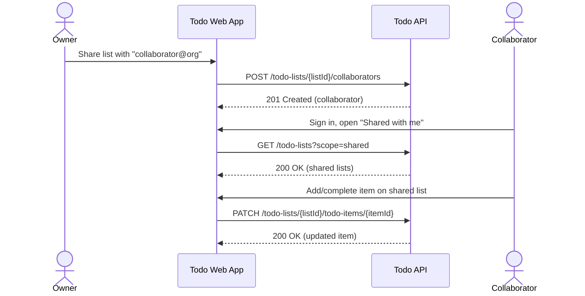
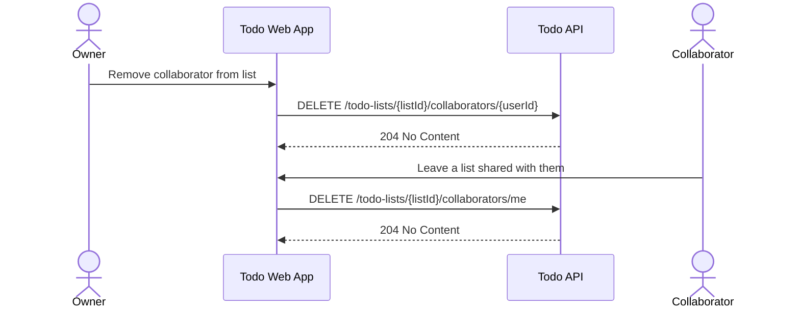

# Todo — Design

## Overview

A single-page React app (`todo-webapp`) lets a signed-in user manage personal and shared todo lists. It calls a Ballerina backend (`todo-api`) for all reads and writes; the API owns list, item, and sharing data in a dedicated PostgreSQL database. Users sign in through Thunder (the platform IDP); the API trusts identity injected by the gateway from the validated token.

## Context (C1)

## Domain model (ER)

## Key flows

### Create a list and add an item

### Share a list with a collaborator

### Owner removes a collaborator / collaborator leaves

